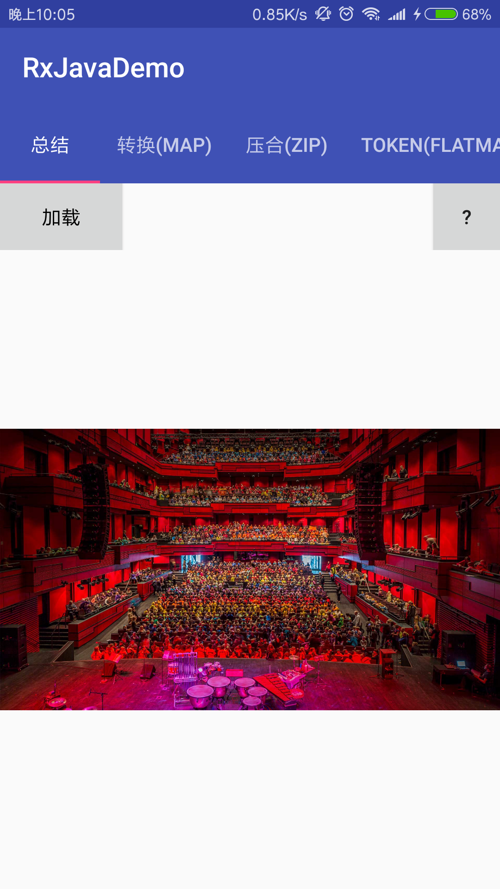

# RxJavaDemo
RxJava+Retrofit2 的常见实际使用场景

* 本项目是模仿[rengwuxian/RxJavaSamples: RxJava 2 和 Retrofit 结合使用的几个最常见使用方式举例 ](https://github.com/rengwuxian/RxJavaSamples)
* 在模仿了几个RxJava+Retrofit2的项目之后,可能缺少没有系统学习,总感觉还不能掌握
  RxJava+Retrofit2 等开源库的精髓,结合了在网上个人认为较为优秀的文章，码了这库。

### 项目截图

App体验链接:[rxjavademo-debug.apk](https://github.com/simplebam/RxJavaDemo/releases/download/v1.0/rxjavademo-debug.apk)

### 推荐项目
* [simplebam/Weather: 天气应用App合集 ](https://github.com/simplebam/Weather)
* [simplebam/Todolist: 这是一个只专注于帮助你记录、管理日常计划任务的界面简洁清爽工具类APP。 ](https://github.com/simplebam/Todolist)
* [DanteAndroid/Beauty: Just watch girls. ](https://github.com/DanteAndroid/Beauty)
* [Will-Ls/WeiYue: 一款新闻客户端, MVP + RxJava + Retrofit + Dagger2 ](https://github.com/Will-Ls/WeiYue)
* [BryantPang/ReadHub: ReadHub 第三方安卓客户端](https://github.com/BryantPang/ReadHub)
* [ListenerMusicPlayer：一款优雅的遵循 Material Design 的开源音乐播放器]( https://www.diycode.cc/projects/hefuyicoder/ListenerMusicPlayer)

项目不在多,在于你自己对知识点的领悟

### 推荐-推荐的不仅仅是技术
* UpateDemo（更新模块）：[simplebam/UpdateDemo: App更新模块源码 ](https://github.com/simplebam/UpdateDemo)
* [Android 项目从零到上线的全过程 - Android - 掘金 ](https://juejin.im/entry/5817ff93128fe1005599a3b3)
* [Android 能让你少走弯路的干货整理 - 简书 ](https://www.jianshu.com/p/514656c383a2)
* [tvvocold/How-To-Ask-Questions-The-Smart-Way: How To Ask Questions The Smart Way 《提问的智慧》中文版 ](https://github.com/tvvocold/How-To-Ask-Questions-The-Smart-Way)
* [或许是介绍Android Studio使用Git最详细的文章 - 温斯渤 - 博客园 ](http://www.cnblogs.com/ghylzwsb/archive/2017/03/12/GitOnAS.html)
* [Android图片压缩的几种方案 ](http://mp.weixin.qq.com/s/-ixGY5E34Fbsy0N3-XTk-Q?utm_source=gank.io&utm_medium=email)
 

### Support
如果你喜欢这个repository，请我喝杯咖啡，我会让它更完美~  

