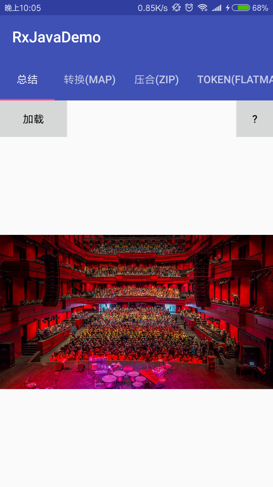
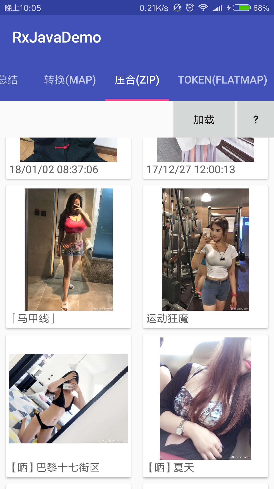

# RxJavaDemo
RxJava+Retrofit2 的常见实际使用场景

* 本项目是模仿[rengwuxian/RxJavaSamples: RxJava 2 和 Retrofit 结合使用的几个最常见使用方式举例 ](https://github.com/rengwuxian/RxJavaSamples)
* 在模仿了几个RxJava+Retrofit2的项目之后,可能缺少没有系统学习,总感觉还不能掌握
  RxJava+Retrofit2 等开源库的精髓,结合了在网上个人认为较为优秀的文章，码了这库。


### 项目截图
<a href="../art/complete.png"></a><a href="../art/zip.png"></a>

App体验链接:[rxjavademo-debug.apk](https://github.com/simplebam/RxJavaDemo/releases/download/v1.0/rxjavademo-debug.apk)

### 项目中用到的知识
* 命名规范-这里主要参考Blankj:[Android 开发规范（完结版） - 简书](https://www.jianshu.com/p/45c1675bec69)
* 单例模式:[设计模式之单例模式 | 吴小龙同學 ](http://wuxiaolong.me/2017/01/02/singleton/)


### 项目中用到的开源库
* RxJava
  * 如果你还不会用,建议先看:[给初学者的RxJava2.0教程(一) - 简书 ](https://www.jianshu.com/p/464fa025229e)
    ,先不用管RxJava使用的什么的观察者模式。快速上手才是最重要的。
  * [关于RxJava最友好的文章 - 掘金 ](https://juejin.im/post/580103f20e3dd90057fc3e6d)
    ,这几篇系列是我觉得讲解RxJava最基础知识中最友好的文章,很多文章一上来就写个
    代码Demo来讲解观察者模式(我基础差,对我来说这一些类似文章最不友好了)。
  * [这可能是最好的RxJava 2.x 教程（完结版） - 简书 ](https://www.jianshu.com/p/0cd258eecf60)
  * [给 Android 开发者的 RxJava 详解 ](http://gank.io/post/560e15be2dca930e00da1083)
    ，朱凯（抛物线）文笔很不错，建议看一下他的文章
  * [Introduction · ReactiveX文档中文翻译 ](https://mcxiaoke.gitbooks.io/rxdocs/content/)
    ,官方文章，永远都是第一步
* OkHttp
  * [Okhttp解析（一）请求的分发，拦截 - 简书 ](https://www.jianshu.com/p/1c39c7bb34ca)
  * [Okhttp解析（二）网络请求的执行 - 简书 ](https://www.jianshu.com/p/601a84fe42a3)
  * [Okhttp解析（三）网络连接的管理 - 简书 ](https://www.jianshu.com/p/9a78fcb77b0a)
  * [Okhttp解析（四）网络连接的建立 - 简书 ](https://www.jianshu.com/p/f7206af8b8a0)
  * [Okhttp解析（五）缓存的处理 - 简书 ](https://www.jianshu.com/p/00d281c226f6)
  * [Android网络编程（六）OkHttp3用法全解析 | 刘望舒的博客](http://liuwangshu.cn/application/network/6-okhttp3.html)
  * 关于OkHttp3无法再通过OkHttpClient.cancel(tag)形式来取消请求,我身边挺多小伙伴纷纷还是使用OkHttp2.x问题,我个人认为技术始终需要更新,并非因为一个     简单的理由就让你停滞,在这里我参考了以下的文章进行取消:
    * [关于取消OkHttp请求的问题 - 简书](https://www.jianshu.com/p/b74466039b84)
    * 上面这篇文章评论这句话说的特别有道理:其实cancel网络请求的时候，如果还未和
      服务器建立连接，它会回调到onFailure()方法中，但是还有一种情况就是它会在
      onResponse的时候刚好cancel网络请求，那么它会在onResponse()方法中抛出
      java.net.SocketException: Socket closed
* Retrofit
   * [你真的会用Retrofit2吗?Retrofit2完全教程 - 简书](https://www.jianshu.com/p/308f3c54abdd)
* Glide
  * [Android图片加载框架最全解析（一），Glide的基本用法 - 郭霖的专栏](http://blog.csdn.net/guolin_blog/article/details/53759439)
    郭霖写的东西都很赞,值得推荐阅读
  * [Google推荐的图片加载库Glide介绍 - 泡在网上的日子](http://www.jcodecraeer.com/a/anzhuokaifa/androidkaifa/2015/0327/2650.html)
  * [Glide 一个专注于平滑滚动的图片加载和缓存库 - 简书](https://www.jianshu.com/p/4a3177b57949)
  * [Glide V4 框架新特性（Migrating from v3 to v4） - HeXinGen的博客 - CSDN博客](http://blog.csdn.net/hexingen/article/details/72578066)


### 注意点
* Rxjava 中订阅的 “subscribe(Observer<? super T> observer)” 有四个方法,其中
  “onSubscribe”所在的线程跟Observable同线程（即依赖subscribeOn方法），其他的
  “onNext”、“onError”以及“onComplete”跟Observer同线程（即依赖observeOn方法）
* 操作符 “map” 所在的线程跟Observable同线程（即依赖subscribeOn方法）
* 操作符 “map”和“flatMap”
  * 前者map是数据类型或者数据结构的改变
  * 后者flatMap是将源Observale转换为新建Observale  <br/>
  * PS: 因为flatmap能转化发射源，既“Observable<RegisterResponse>” ->
    "Observable<LoginResponse>" ,配合Retrofit就能在完成注册事件后继续完成登
    录事件。map操作符只能把“Observable<RegisterResponse>”里面的
    “RegisterResponse”转化成“LoginResponse”，而“LoginResponse”只是一个
    model对象，不能作为发射源完成登录操作。


### 开发中遇到的问题
* 我把activity_main布局里面的 TabLayout 的 id 设置为 android:id="@+id/tabs
  报了下面的错误:
  ```
      java.lang.RuntimeException: Unable to start activity
      ComponentInfo{com.yueyue.rxjavademo/com.yueyue.rxjavademo.
      MainActivity}: java.lang.IllegalStateException:
      Required view 'tabs' with ID 16908307 for field 'tabLayout' was
      not found. If this view is optional add '@Nullable' (fields) or '@Optional' (methods) annotation.
  ```
  这里[Android 在fragment中使用tabhost - 小猴偷米 - 博客园 ](http://www.cnblogs.com/wolf-bing/p/3151452.html)
  指出了  TabLayout 应该设置 android:id="@android:id/tabs"
* 这里我在原项目看到 "compile 'com.android.support:support-v13:26.1.0'" 这个
  依赖居然是 v13 时候,我就感觉很好奇了,百度了一下:[Android兼容包Support v4.v7.v13区别与应用场景 - CSDN博客 ](https://blog.csdn.net/woshimalingyi/article/details/50800259)
* 由于装逼王(http://www.zhuangbi.info/)已经失效,这里我决定使用易源数据/showapi
  的[花瓣福利](https://www.showapi.com/api/lookPoint/819) 作为补充
* 之前就略有所闻部分大牛开始倡导不建议使用Enum枚举类型,比如:[从一道面试题开始说起 枚举、动态代理的原理-玩Android - wanandroid.com ](http://www.wanandroid.com/blog/show/2038)
  ,之后看到替换方法:[Android中代替枚举的@IntDef用法 - 简书 ](https://www.jianshu.com/p/422b7a91835a)
* 一般而言,我们都会想到数据的本地缓存,图片就有三级缓存(LruCache+DiskLruCache+Net)
  ,从网络缓存load下来的其他数据就下需要使用数据库/文件保存,这些是很基础的问题,但
  现在可能有更好的实现方法,比如
  * 图片三级缓存:Glide(保存图片,实现磁盘+内存+网络),使用文件保存网络图片路径即可
  * 网路加载回来的数据保存,直接使用OkHttp即可,详看:[Android Retrofit 2.0 使用-补充篇 - 简书 ](https://www.jianshu.com/p/93153b34310e)


### RxJava + Retrofit2 推荐
* [rengwuxian/RxJavaSamples: RxJava 2 和 Retrofit 结合使用的几个最常见使用方式举例 ](https://github.com/rengwuxian/RxJavaSamples)
* [RxJava常见的使用场景总结 - 简书 ](https://www.jianshu.com/p/6917510b0e4c)
* [可能是东半球最全的RxJava使用场景小结 - CSDN博客 ](https://blog.csdn.net/theone10211024/article/details/50435325)
* [安卓开发进阶之RxJava在实际项目中使用--第一篇 - CSDN博客 ](https://blog.csdn.net/zhangxiangliang2/article/details/74055571)
* [ReactiveNetwork - CSDN博客 ](https://blog.csdn.net/u011277123/article/details/51969139)
* [pwittchen/ReactiveNetwork: Android library listening network connection state and Internet connectivity with RxJava Observables ](https://github.com/pwittchen/ReactiveNetwork)

